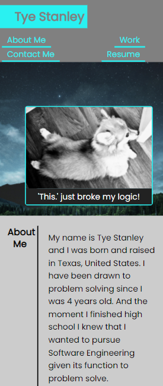

# Tye's Portfolio

## Description

Hello my name is Tye and this is my own portfolio. I've made it to keep a collection of all my future projects all neatly organized together in one place. My portfolio currently has 2 other projects within it all with responsive design for a mobile friendly experience. What you will find on my portfolio is a section dedicated talking a little bit about me. If you are interested in learning a bit more feel free to visit. Under the work section will be where you'll have access to all of my projects. Near the bottom is my contact information as well.

## Portfolio Links

[My Website](https://tyestanley.github.io/portfolio/)

[Project Repository](https://github.com/TyeStanley/portfolio)

## Portfolio Showcase
This is the top of my homepage.

## Responsive Design
Tablet Screen Size:

Large Phone Size:

Medium Phone Size:

Small Phone Size:

## License

 MIT License

Copyright (c) 2022 Tye Stanley

Permission is hereby granted, free of charge, to any person obtaining a copy
of this software and associated documentation files (the "Software"), to deal
in the Software without restriction, including without limitation the rights
to use, copy, modify, merge, publish, distribute, sublicense, and/or sell
copies of the Software, and to permit persons to whom the Software is
furnished to do so, subject to the following conditions:

The above copyright notice and this permission notice shall be included in all
copies or substantial portions of the Software.

THE SOFTWARE IS PROVIDED "AS IS", WITHOUT WARRANTY OF ANY KIND, EXPRESS OR
IMPLIED, INCLUDING BUT NOT LIMITED TO THE WARRANTIES OF MERCHANTABILITY,
FITNESS FOR A PARTICULAR PURPOSE AND NONINFRINGEMENT. IN NO EVENT SHALL THE
AUTHORS OR COPYRIGHT HOLDERS BE LIABLE FOR ANY CLAIM, DAMAGES OR OTHER
LIABILITY, WHETHER IN AN ACTION OF CONTRACT, TORT OR OTHERWISE, ARISING FROM,
OUT OF OR IN CONNECTION WITH THE SOFTWARE OR THE USE OR OTHER DEALINGS IN THE
SOFTWARE.